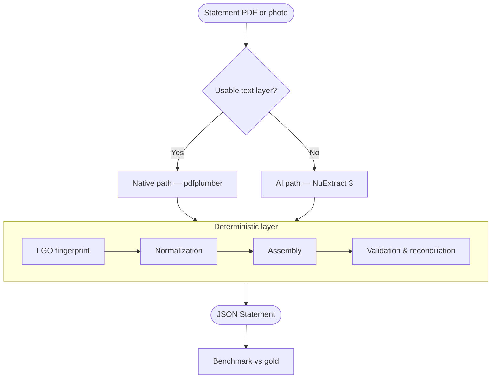

# Architecture

> Local pharmacy sales statement extractor → structured, validated JSON.

## Vision

Replace **Google Document AI** with a **self-hosted, free** pipeline that produces the same canonical JSON without sending data to the cloud.

## Pipeline



## Principles

1. **Two paths, one business logic** — AI reads the document; the deterministic layer validates and normalizes.
2. **JSON config** — LGO fingerprints, column aliases, month abbreviations: never hard-coded.
3. **Self-validation** — Σ quantities = printed Total (`totals_reconciled`).
4. **Offline** — no network calls in production.

## Output schema

Single `Statement` model (monthly + period). See [`src/phaxtract/schema.py`](../src/phaxtract/schema.py).

## Repository layout

```
phaxtract/
├── src/phaxtract/       # Python package
│   ├── schema.py        # Pydantic models
│   ├── config/          # JSON business rules
│   ├── fingerprint.py   # LGO identification
│   ├── normalize.py     # months, columns, FR decimals
│   ├── validate.py      # reconciliation
│   ├── benchmark.py     # scoring vs gold
│   ├── ingest.py        # (phase 2) document type detection
│   ├── extract_native.py# (phase 2) PDF path
│   ├── extract_ai.py    # (phase 3) NuExtract path
│   ├── pipeline.py      # orchestrator
│   └── cli.py           # Typer CLI
├── gold/                # synthetic test fixtures (versioned)
├── tests/
├── scripts/
├── docs/
└── app/                 # Streamlit (phase 4)
```

## Target metrics

| Metric | Target |
| ------ | ------ |
| Cell-level precision | ≥ 98% |
| Reconciliation rate | ≥ 95% |
| LGO coverage | ≥ 3 LGOs |

## Stack

Python ≥ 3.11 · Pydantic v2 · pdfplumber · PyMuPDF · rapidfuzz · NuExtract 3 (phase 3) · pytest · ruff · mypy

Full specification: [`SPECIFICATION.md`](SPECIFICATION.md)
