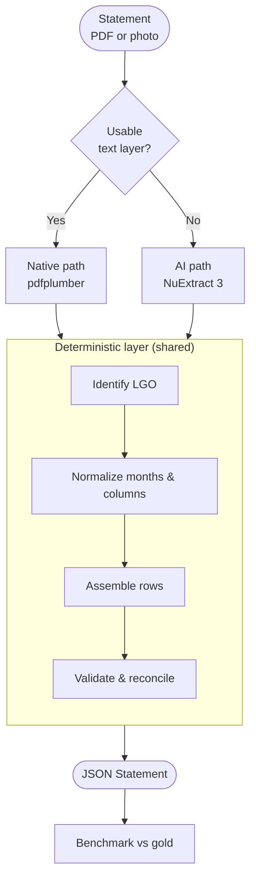
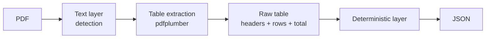
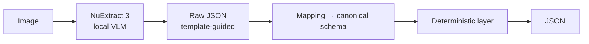
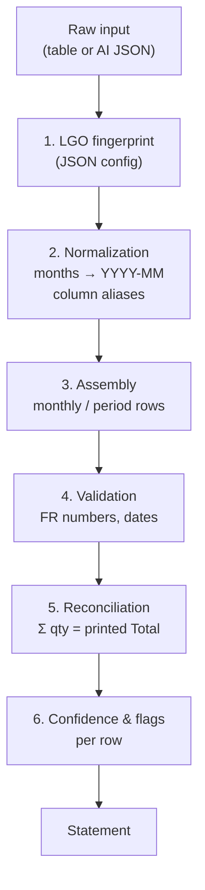
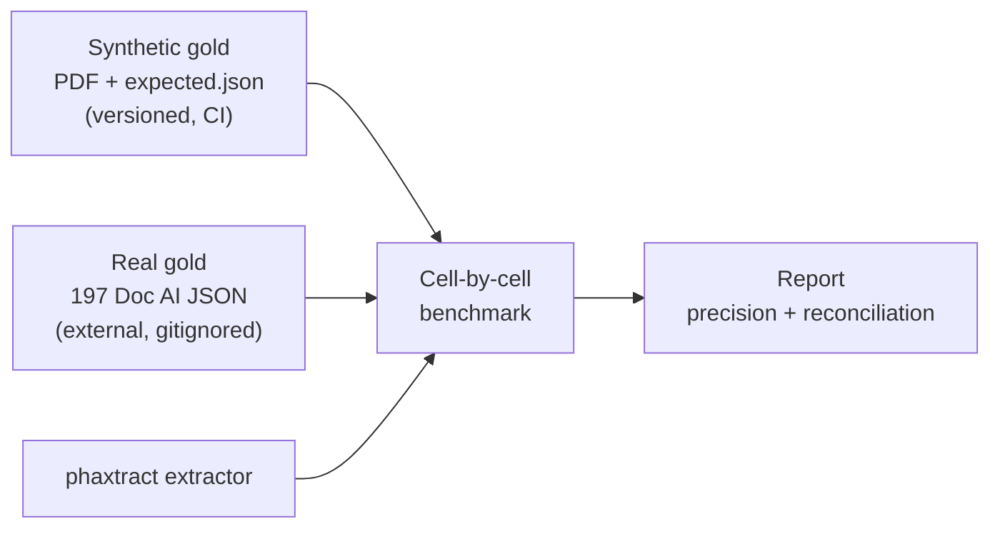
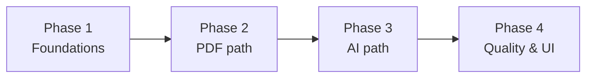

# Specification

## One-liner

Replace **Google Document AI** with a **local, free** extractor that turns pharmacy sales statements (PDF or photos) into **structured, validated JSON**.

---

## Context

Labs receive **sales statements** from pharmacies. Today, extraction goes through **Google Document AI** (cloud, paid, ~197 manually annotated documents).

**Goal:** produce the same JSON, self-hosted, with no API calls.

| | Google Document AI | phaxtract (target) |
| --- | --- | --- |
| Cost | Pay per page | Free |
| Hosting | Google Cloud | Local (GPU for photos) |
| Data | Sent to cloud | Stays on-premises |
| Output | Entity JSON | Single canonical JSON |

---

## Document types

Two formats, **one output schema**:

| Type | Description |
| ---- | ----------- |
| **Monthly** | Product × month grid (EAN, designation, qty per month column) |
| **Period** | Transaction list (date, qty, amount) grouped by product |

Statements come from different **LGO** (pharmacy management systems): varied layouts, different column labels, French month abbreviations.

---

## Target pipeline



**Principle:** two extraction paths, **one downstream business logic**. AI does not replace validation — it only reads the document.

---

## Path 1 — Native PDF

~495 PDFs with selectable text layer. No AI, no GPU.



**Steps:**

1. **Ingestion** — open PDF, verify text layer presence
2. **Extraction** — read table grids/rows (pdfplumber)
3. **Deterministic layer** — see dedicated section

**Constraints:** free, fast, reproducible. Priority path to implement first.

---

## Path 2 — Photo / scan

Main volume: paper statement photos, scans, image-only PDFs.



**Steps:**

1. **Inference** — NuExtract 3 receives image + JSON template describing expected structure
2. **Mapping** — convert raw output to `Statement` schema
3. **Deterministic layer** — same as native path

**Model:** [NuExtract 3](https://huggingface.co/numind/NuExtract3) (~4B, Apache-2.0)  
**Hardware:** 12 GB GPU min (RTX 4070, 4-bit inference)  
**Fine-tuning:** optional LoRA on annotated gold if zero-shot is insufficient

**Out of scope:** LayoutLMv3, geometric OCR, cloud APIs.

---

## Deterministic layer

Core business logic. Independent of input path.



| Step | Responsibility |
| ---- | -------------- |
| Fingerprint | Recognize which LGO produced the statement (regex + config signatures) |
| Normalization | `jun` → `2025-06`, map column labels to canonical fields |
| Assembly | Build row objects for monthly or period type |
| Validation | Parse FR decimals, dates, type coercion |
| Reconciliation | Verify Σ quantities = document Total row |
| Scoring | Assign confidence score and explicit flags |

**Golden rule:** all business rules (months, aliases, LGO signatures) live in **JSON config**, never hard-coded.

---

## Output JSON schema

Single `Statement` model for both statement types:

```jsonc
{
  "document": {
    "source_file": "statement.pdf",
    "lgo": "etat_des_ventes",
    "statement_type": "monthly",
    "pharmacy": { "name": "...", "address": "...", "id": "..." },
    "supplier": "...",
    "months": ["2026-01", "2025-12"],
    "generated_at": "2026-02-27",
    "page_count": 5
  },
  "lines": [{
    "code_produit": "3614810004843",
    "designation": "...",
    "prices": { "pa_cat": 32.0, "pa_cat_net": 20.48, "pv_ttc": 49.95 },
    "quantities": { "2026-01": 3, "2025-12": 3 },
    "confidence": 0.98,
    "source": { "page": 1, "row_bbox": [0, 0, 0, 0] }
  }],
  "validation": {
    "totals_reconciled": true,
    "row_count": 9,
    "flags": []
  }
}
```

**Reconciliation** (`totals_reconciled`) is the primary quality criterion: each document validates itself.

---

## Gold set & quality



| Metric | Target |
| ------ | ------ |
| Cell-level precision | ≥ 98% |
| Reconciliation rate | ≥ 95% |
| LGO coverage | ≥ 3 different LGOs |

**Synthetic gold:** generated PDFs reproducing real layouts, with expected JSON — for automated tests.  
**Real gold:** manually corrected Google Document AI exports — for real-world quality measurement.

---

## Review interface (optional, phase 4)

Local read-only Streamlit app:

- **Dashboard** — quality metrics per LGO, comparison vs gold
- **Viewer** — upload a statement, visualize extraction

No auth, no database, no editing in v1.

---

## Tech stack

| Component | Choice |
| --------- | ------ |
| Language | Python ≥ 3.11 |
| Schema | Pydantic v2 |
| Native PDF | pdfplumber + PyMuPDF |
| Normalization | rapidfuzz, python-dateutil |
| Photo AI | NuExtract 3, transformers, PEFT/LoRA |
| UI | Streamlit (phase 4) |
| Tests | pytest |
| Network | None in production |

---

## Implementation phases



### Phase 1 — Foundations

- Pydantic schema (`Statement`, `Line`, `Document`…)
- JSON config (LGO fingerprints, column aliases, month abbreviations)
- Deterministic layer: normalize, validate, reconcile
- Synthetic gold + cell-by-cell benchmark
- Unit tests on deterministic layer

### Phase 2 — Native PDF path

- Ingestion (text layer detection)
- Table extraction (pdfplumber)
- Pipeline: ingest → extract → assemble → JSON
- CLI: `extract` + `benchmark`
- Benchmark on synthetic gold then real gold

### Phase 3 — AI path (photos)

- NuExtract 3 inference (zero-shot)
- Extraction template + mapping to `Statement`
- Automatic router: native PDF vs photo
- Benchmark NuExtract vs real gold
- LoRA fine-tune if precision < 90%

### Phase 4 — Quality & UI

- Multi-page handling (split + merge)
- Streamlit app (dashboard + viewer)
- Harden reconciliation (cases without Total row)
- Operational documentation (GPU deployment)

---

## Target repository layout

```
phaxtract/
├── src/phaxtract/
│   ├── schema.py           # Pydantic models
│   ├── config/             # JSON business rules
│   ├── ingest.py           # document type detection
│   ├── extract_native.py   # PDF path
│   ├── extract_ai.py       # NuExtract path
│   ├── normalize.py        # normalization
│   ├── validate.py         # validation + reconciliation
│   ├── fingerprint.py      # LGO identification
│   ├── pipeline.py         # orchestrator
│   ├── benchmark.py        # scoring vs gold
│   └── cli.py              # CLI entry point
├── gold/
│   ├── *.pdf               # synthetic gold (versioned)
│   └── *.expected.json
├── tests/
├── scripts/
│   ├── generate_gold.py
│   └── ml/                 # train, eval, predict NuExtract
├── app/                    # Streamlit (phase 4)
├── docs/
│   └── ARCHITECTURE.md
├── pyproject.toml
└── README.md
```

---

## Locked decisions

| Topic | Choice | Reason |
| ----- | ------ | ------ |
| PDF path | pdfplumber | Free, reliable on native text |
| Photo path | NuExtract 3 | Zero-shot, simple pipeline, fine-tune possible |
| LayoutLMv3 | No | Dataset too small, complex assembler |
| Geometric OCR | No | Insufficient precision (~5%) |
| Google Doc AI | Gold only | Benchmark reference, not production |
| Business rules | JSON config | Add an LGO without touching code |
